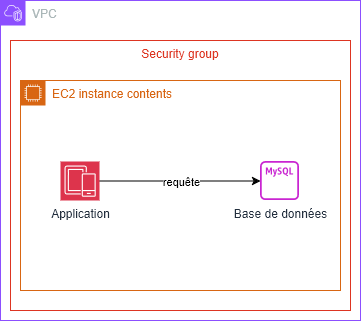

# Phase 1

## Architecture

## Synthèse 

### Résultats
- L’instance est accessible depuis son IP publique.
- L’application répond correctement sur le port 80.
- Le déploiement est opérationnel.

### Choix techniques
- Utilisation de Terraform pour automatiser le provisionnement.
- Ouverture du port 80 pour l’accès web.
- Utilisation du script d’initialisation pour lancer l’application.

### Difficultés rencontrées
Pas de difficultés majeures rencontrées lors de cette phase.